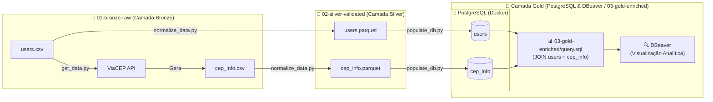

# 🏅 ETL Medallion Architecture

Pipeline de dados desenvolvida em Python fundamentada nos conceitos da **Arquitetura Medalhão** (*Medallion Architecture*), realizando a ingestão de dados brutos de usuários, enriquecimento geográfico via API pública do **ViaCEP**, processamento colunar em formato **Parquet** e carga em banco de dados relacional **PostgreSQL** para consultas e visualização analítica no **DBeaver**.

---

## 🏛️ Camadas da Arquitetura

| Camada | Diretório / Destino | Formato | Descrição |
|---|---|---|---|
| 🥉 **Bronze** | `01-bronze-raw` | CSV / JSON | Dados brutos ingeridos diretamente das fontes e APIs, preservando o estado original |
| 🥈 **Silver** | `02-silver-validated` | Parquet | Dados limpos, deduplicados e estruturados em formato colunar para consulta eficiente |
| 🥇 **Gold / DW** | PostgreSQL (`db`) & `03-gold-enriched` | SQL / Parquet | Tabelas relacionais estruturadas no PostgreSQL e visões analíticas prontas para consumo e BI |

---

## ⚙️ Funcionamento da Pipeline

1. **Ingestão e Enriquecimento (`get_data.py`)**:
   - Consome os dados brutos de usuários presentes em `01-bronze-raw/users.csv`.
   - Consulta a API pública [ViaCEP](https://viacep.com.br/) para cada CEP.
   - Grava as informações de endereço e localização em `01-bronze-raw/cep_info.csv`.

2. **Normalização e Validação (`normalize_data.py`)**:
   - Lê os arquivos brutos (`.csv` e `.json`) presentes na camada Bronze.
   - Converte estruturas complexas (listas/dicionários) para strings e remove registros duplicados.
   - Salva os dados limpos e compactados em formato `.parquet` dentro de `02-silver-validated/`.

3. **Carga no Banco Relacional (`populate_db.py` & `db.py`)**:
   - Inicializa a conexão com o PostgreSQL orquestrado via Docker Compose.
   - Cria dinamicamente as tabelas (`users` e `cep_info`) baseadas nos esquemas das colunas dos arquivos Parquet.
   - Executa a inserção parametrizada dos registros da camada Silver no PostgreSQL.

4. **Exploração e Visualização Analítica (`DBeaver`)**:
   - Conecta ao PostgreSQL local para inspecionar schemas, tabelas e executar consultas relacionais (JOINs, agregações e análises).

---

## 🛠️ Tecnologias Utilizadas

- **Linguagem:** Python 3.10+
- **Manipulação e Engenharia de Dados:** `pandas`
- **Armazenamento Colunar:** `pyarrow` (Parquet)
- **Banco de Dados Relacional:** PostgreSQL 16
- **Driver de Conexão SQL:** `psycopg2-binary`
- **Containerização:** Docker & Docker Compose
- **Visualização e Gestão de Dados:** DBeaver
- **Requisições HTTP:** `requests`
- **Diagramação e Arquitetura:** Excalidraw / Mermaid

---

## 📁 Estrutura do Projeto

```text
ETL-medalion-architecture/
│
├── 01-bronze-raw/            # Camada Bronze: dados brutos
│   ├── users.csv             # Dados cadastrais brutos dos usuários
│   └── cep_info.csv          # Dados de geolocalização obtidos via ViaCEP
│
├── 02-silver-validated/      # Camada Silver: dados limpos e tipados
│   ├── users.parquet         # Dataset de usuários em formato Parquet
│   └── cep_info.parquet      # Dataset de CEPs validado em Parquet
│
├── 03-gold-enriched/         # Camada Gold: visões analíticas prontas para consumo
│   └── query.sql             # Consulta SQL analítica com JOIN e enriquecimento
│
├── db.py                     # Módulo utilitário de conexão e operações SQL (PostgreSQL)
├── populate_db.py            # Script de carga da camada Silver para o PostgreSQL
├── get_data.py               # Script de enriquecimento via API ViaCEP
├── normalize_data.py         # Script de normalização (Bronze -> Silver)
├── docker-compose.yml        # Orquestração do serviço PostgreSQL via Docker
├── arquitetura-medalhao.excalidraw   # Diagrama conceitual das camadas do medalhão
├── fluxo-da-arquitetura.excalidraw   # Diagrama vetorial do fluxo da pipeline
└── README.md                 # Documentação do projeto
```

---

## 🚀 Como Executar

### 1. Configurar o ambiente virtual

```bash
# Criar o ambiente virtual
python -m venv .venv

# Ativar no Windows (PowerShell)
.\.venv\Scripts\Activate.ps1

# Ativar no Linux/WSL/macOS
source .venv/bin/activate
```

### 2. Instalar dependências

```bash
pip install pandas requests pyarrow psycopg2-binary
```

### 3. Iniciar o Banco de Dados PostgreSQL (Docker)

```bash
docker compose up -d
```

> 📌 O PostgreSQL estará exposto no host através da porta **5433**.

### 4. Executar o fluxo ETL completo

```bash
# 1. Enriquecer dados dos usuários consultando a API ViaCEP
python get_data.py

# 2. Normalizar e converter os dados da camada Bronze para Silver (Parquet)
python normalize_data.py

# 3. Criar as tabelas e carregar os dados no PostgreSQL
python populate_db.py
```

---

## 🔍 Visualização e Consulta no DBeaver

Para explorar e validar as tabelas no **DBeaver**:

1. Abra o **DBeaver** e selecione **Nova Conexão** -> **PostgreSQL**.
2. Configure os parâmetros da conexão:
   - **Host:** `localhost`
   - **Porta:** `5433`
   - **Database:** `postgres`
   - **Username:** `postgres`
   - **Password:** `postgres`
3. Teste a conexão e clique em **Concluir**.
4. No navegador de banco de dados à esquerda, navegue até: `postgres -> Schemas -> public -> Tables`.
5. Você visualizará as tabelas **`users`** e **`cep_info`** prontas para consulta.

### 🥇 Camada Gold e Consulta Analítica no DBeaver

A consulta analítica que consolida a **Camada Gold** está versionada no arquivo [`03-gold-enriched/query.sql`](./03-gold-enriched/query.sql). Ela realiza a junção relacional (`LEFT JOIN`) e deduplicação (`DISTINCT`) entre a tabela de usuários e as informações enriquecidas de CEP:

```sql
SELECT 
    DISTINCT
    users.id,
    users.nome,
    users.email,
    users.data_nascimento,
    users.genero,
    users.cep,
    cep_info.logradouro,
    cep_info.complemento,
    cep_info.unidade,
    cep_info.bairro,
    cep_info.localidade,
    cep_info.uf,
    cep_info.estado,
    cep_info.regiao,
    cep_info.ibge,
    cep_info.gia,
    cep_info.ddd,
    cep_info.siafi
 FROM users
LEFT JOIN cep_info 
ON users.cep = cep_info.cep
ORDER BY users.id;
```

---

## 🔄 Fluxo da Arquitetura Medalhão



> 📌 **Diagramas Editáveis:**
> - [fluxo-da-arquitetura.excalidraw](./fluxo-da-arquitetura.excalidraw) — Fluxo visual completo de componentes e scripts da pipeline.
> - [arquitetura-medalhao.excalidraw](./arquitetura-medalhao.excalidraw) — Diagrama conceitual das camadas Bronze, Prata e Ouro.
